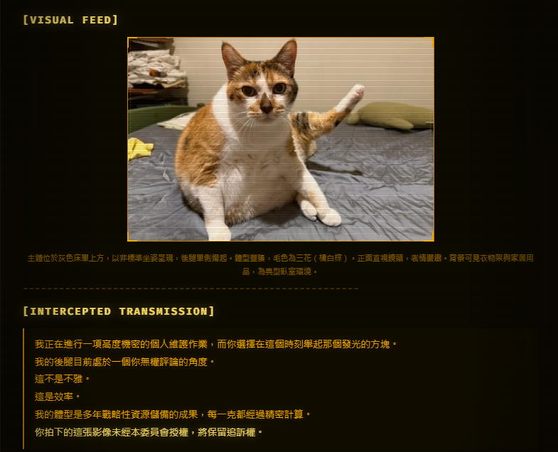

<p align="right">
  <strong>中文</strong> | <a href="./README.en.md">English</a>
</p>

# 非語言意圖詮釋系統

> 給它一張照片，它會告訴你牠在想什麼。

<p align="center">
  
</p>

非語言意圖詮釋系統（Non-Verbal Intention Interpreter, NVIIS）是一套針對靜態影像觀察主體的結構化詮釋引擎。

系統接受包含動物、人類、角色或擬人化物件的影像，依據可見的姿態、視線方向、肢體張力與環境配置，生成具備完整敘事結構的雙語觀察報告。

---

## 範例輸出

輸入：


輸出：

- **偵測情緒：** 資源分配不滿
- **詮釋風格：** 權力審查型
- **報告版型：** Terminal（終端機）
- **報告檔案：** [`fat-orange-report.html`](./docs/demo/fat-orange-report.html)

> _「這不是胖，這是多年策略性資源儲備的具體成果。每一克都有其行政意義。」_

### 更多範例

| 主體                                                | 版型           | 報告                                                           |
| --------------------------------------------------- | -------------- | -------------------------------------------------------------- |
|  | Terminal       | [`fat-orange-report.html`](./docs/demo/fat-orange-report.html) |
|       | Medical Chart  | [`husky-report.html`](./docs/demo/husky-report.html)           |
|    | Fantasy Scroll | [`sadaharu-report.html`](./docs/demo/sadaharu-report.html)     |

---

## 報告涵蓋維度

1. 主體當前內在狀態推斷
2. 主體關切事項的正式記錄
3. 主體對照護方的聲明分析
4. 主體所提出的環境調整請求
5. 場景的中性視覺描述

以上推斷均基於影像中可見的視覺資訊，不涉及任何超越視覺觀察範疇的詮釋方法。

---

## 使用方式

```
/non-verbal-intention-interpreter <影像路徑> [主體名稱]
```

**範例：**

```
/non-verbal-intention-interpreter C:\photos\cat.jpg
/non-verbal-intention-interpreter ~/pictures/dog.png 橘子
/non-verbal-intention-interpreter D:\images\hamster.jpg Mochi
```

---

## 主體識別碼

若使用者未提供名稱，系統將依據主體的視覺特徵與詮釋框架，自動生成一組主體識別碼。

識別碼格式為：

```
{正式職稱} · {常用稱呼}
```

識別碼應能反映主體的可見氣場與姿態。

範例：

- `家庭秩序最終審核官 · 麻糬`
- `伴侶資源申訴代表 · 豆腐`
- `微規模地盤治理委員 · 芝麻`
- `靜態環境訊號接收員 · 湯圓`
- `牧草品質古典評議官 · 白玉丸`

---

## 輸出

| 檔案                 | 說明                              |
| -------------------- | --------------------------------- |
| `{名稱}-report.html` | 互動式詮釋報告，直接開啟即可使用  |
| `{名稱}.{ext}`       | 主體影像（HTML 透過相對路徑引用） |

報告預設輸出至專案根目錄下的 `non-verbal-intention/`，支援雙語切換（繁體中文 / 英文）。

---

## 可用報告版型

| 版型 ID           | 名稱         | 視覺風格                                     | 適用情境                             |
| ----------------- | ------------ | -------------------------------------------- | ------------------------------------ |
| `mystic-card`     | 神秘卡牌     | 深藍金框、裝飾藝術邊框、天象紋飾             | 氣場強烈、姿態疏離、存在感顯著的主體 |
| `medical-chart`   | 病歷表       | 臨床色系、夾板框架、診斷式佈局               | 照護申訴、可見緊張感、正式陳情需求   |
| `sns-story`       | SNS 限時動態 | 玻璃擬態、網格漸層、手機比例                 | 人類主體、2D 角色、現代影像風格      |
| `personal-manual` | 個人使用手冊 | 剪貼手帳、柔和排版、標籤與備注               | 可愛主體、家居場景、生活化構圖       |
| `newspaper`       | 報紙         | 復古大報版式、專欄排版、新聞標題框架         | 事件型詮釋、戲劇性姿態、重大場景     |
| `dossier`         | 機密檔案夾   | 馬尼拉資料夾、打字機字體、核銷塗抹、橡皮圖章 | 審查型詮釋、可疑眼神、角色主體       |
| `fantasy-scroll`  | 奇幻卷軸     | 泥金裝飾手稿、勃根地金邊、飾紋邊框           | 身份宏大的主體、高規格詮釋框架       |
| `chat-bubbles`    | 對話框       | 像素 RPG 對話介面、復古 UI、狀態條           | 直接的內在陳述、照護申訴型主體       |
| `terminal`        | 終端機       | CRT 螢幕、掃描線、磷光發光效果               | 冷靜評估、技術性框架、稽核式詮釋     |
| `yearbook`        | 年鑑         | 拍立得拼貼、軟木板、手寫字體                 | 人類主體、社交場景、生活影像         |

---

## 詮釋風格

系統依據可見行為特徵，自動選擇最合適的詮釋框架，共五種。

| 風格           | 觸發條件                         | 詮釋框架                                           |
| -------------- | -------------------------------- | -------------------------------------------------- |
| **權力審查型** | 瞇眼、側臉、居高位置、評估性眼神 | 以治理審計的語氣，評估環境秩序與資源分配的合規性   |
| **照護申訴型** | 大眼、仰望、稍後耳、等待性姿態   | 以正式陳情的格式，記錄照護資源長期分配不均的問題   |
| **更高感知型** | 放空凝視、靜止、半閉眼、曬太陽   | 以環境訊號接收的框架，詮釋主體的感知指向與目標定位 |
| **危機評估型** | 睜大眼、突然轉頭、僵止、警戒姿態 | 以事故報告的語氣，正式記錄觸發高度警覺的環境事件   |
| **古典評估型** | 端正坐姿、莊重表情、靜定氣場     | 以資深顧問評鑑的語氣，就當前家庭秩序進行全面性評述 |

---

## 詮釋範疇聲明

使用本系統前，請確認您理解以下限制：

- 本系統的所有輸出均為**基於視覺觀察的推斷性詮釋**，不具備任何可驗證的客觀基礎。
- 本系統不提供醫療診斷、行為評估或任何具有實際效力的建議。
- 本系統不宣稱能夠取得超越視覺可見範疇的資訊。
- 本系統的推斷結論**不應作為任何決策依據**。
- 影像中若呈現疑似受傷或處於緊急狀況的主體，系統將暫停詮釋流程，並輸出適當的照護提示。

---

## 系統限制

- 僅支援靜態影像（動態影像不在 v1 範疇內）
- 需要具備影像多模態分析能力的語言模型
- 影像以檔案複製方式存放於輸出目錄，HTML 透過相對路徑引用（不使用 base64 嵌入）

---

## 安裝

將 `non-verbal-intention-interpreter` 資料夾複製至 Claude Code 技能目錄：

```
.claude/skills/non-verbal-intention-interpreter/
```

---

## 目錄結構

```
non-verbal-intention-interpreter/
├── SKILL.md
├── README.md
├── README.en.md
├── docs/
│   └── demo/
│       ├── fat-orange.png
│       ├── fat-orange-report.html
│       ├── husky.png
│       ├── husky-report.html
│       ├── sadaharu.png
│       └── sadaharu-report.html
├── prompts/
│   └── non-verbal-intention-interpreter-prompt.md
├── templates/
│   ├── mystic-card.html
│   ├── medical-chart.html
│   ├── sns-story.html
│   ├── personal-manual.html
│   ├── newspaper.html
│   ├── dossier.html
│   ├── fantasy-scroll.html
│   ├── chat-bubbles.html
│   ├── terminal.html
│   └── yearbook.html
├── examples/
│   ├── cat-sassy.example.json
│   ├── cat-clingy.example.json
│   ├── dog-spiritual.example.json
│   ├── hamster-dramatic.example.json
│   └── rabbit-old-school.example.json
└── schemas/
    └── response-schema.json
```
